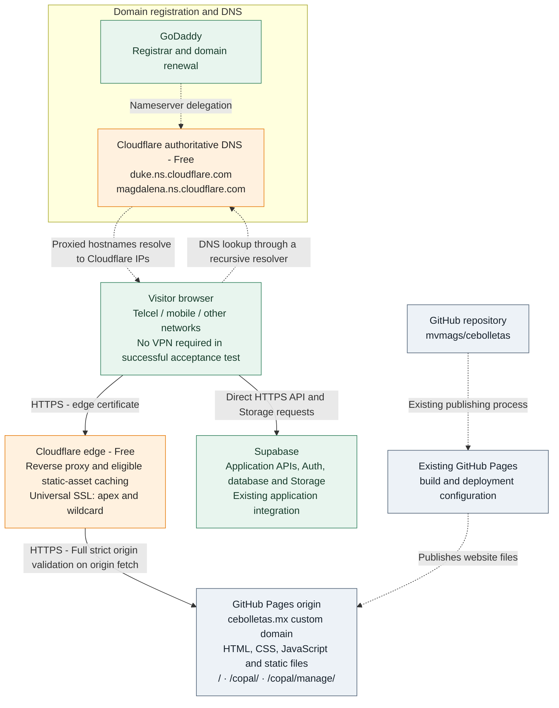

# Cebolletas.mx

Static website and Copal application hosted on **GitHub Pages**, with **Cloudflare Free** providing authoritative DNS and the public HTTPS reverse proxy.

Infrastructure migration date: **2026-09-13**. This document records the configuration verified through provider dashboards and the owner's post-migration checks on that date; it is not a live status page.

| Resource | Location |
|---|---|
| Repository | [mvmags/cebolletas](https://github.com/mvmags/cebolletas) |
| Website | [cebolletas.mx](https://cebolletas.mx/) |
| Copal | [cebolletas.mx/copal/](https://cebolletas.mx/copal/) |
| Management | [cebolletas.mx/copal/manage/](https://cebolletas.mx/copal/manage/) |
| WWW | [www.cebolletas.mx](https://www.cebolletas.mx/) |
| Application documentation | [Copal README](copal/README.md), [Management README](copal/manage/README.md) |

## Infrastructure diagram

GitHub renders this Mermaid diagram directly in the README. Solid arrows show website and API requests; dashed arrows show DNS delegation/resolution and publishing relationships. Responses return along the corresponding request paths.



The website request path is **browser → Cloudflare → GitHub Pages**. Cached eligible assets can be served directly by the edge. GoDaddy is not an HTTP hop. Supabase requests made by browser code use the configured Supabase host directly; the `cebolletas.mx` proxy does not automatically put those endpoints behind this Cloudflare zone.

## Responsibilities and scope

| Service | Responsibility |
|---|---|
| GoDaddy | Domain registration, renewal and registrar-level nameserver delegation |
| Cloudflare Free | Authoritative DNS, reverse proxy/CDN and edge TLS |
| GitHub | Source repository, existing Pages build/deployment and origin hosting |
| Supabase | Existing Copal backend services, access controls and Storage |

This migration did **not** move hosting to Cloudflare Pages, introduce Workers, alter the custom domain, or change application code, Supabase integration, reservation logic or Pages deployment configuration. Keep the root [CNAME](CNAME) set to `cebolletas.mx`. The exact Pages publishing source is managed in GitHub repository Settings → Pages; it was not reconfigured during this migration.

The existing [gallery manifest workflow](.github/workflows/update-gallery-manifest.yml) is separate from DNS/proxy configuration. Application setup and migration instructions remain in the linked Copal documentation; this README records the production hosting topology.

## Why Cloudflare was introduced

Before migration, the owner observed `ERR_CONNECTION_TIMED_OUT` on affected Telcel/mobile connectivity in Mexico. The root website failed as well as the Copal paths.

The supplied diagnostics showed:

- DNS returned the expected GitHub Pages IPv4 and IPv6 addresses.
- `curl --resolve` bypassed DNS and tested all four GitHub Pages IPv4 addresses on TCP/443. Each timed out before TLS negotiation.
- `mvmags.github.io`, using the same GitHub Pages IPv4 range, also timed out without VPN.
- Routing the same connection through NordVPN Phoenix allowed TCP, TLS and an HTTP 200 response from GitHub.

This evidence supports a network-path problem between the affected connection and GitHub Pages, rather than an application-routing or DNS-record error. The exact failing network segment was not isolated. Cloudflare changes the client's destination to its edge addresses and fetches the origin over a separate connection.

## Production DNS configuration

Registrar nameservers saved at GoDaddy:

```text
duke.ns.cloudflare.com
magdalena.ns.cloudflare.com
```

Manage the authoritative zone's application records in Cloudflare. The GitHub IPs below remain the **origin destinations stored in Cloudflare**; public queries for proxied hostnames should return Cloudflare addresses instead. Do not replace origin values with the public Cloudflare answers.

All 11 records showed TTL **Auto** in the final Cloudflare dashboard.

| Type | Hostname | Content / origin target | Proxy status |
|---|---|---|---|
| A | `@` | `185.199.108.153` | Proxied |
| A | `@` | `185.199.109.153` | Proxied |
| A | `@` | `185.199.110.153` | Proxied |
| A | `@` | `185.199.111.153` | Proxied |
| AAAA | `@` | `2606:50c0:8000::153` | Proxied |
| AAAA | `@` | `2606:50c0:8001::153` | Proxied |
| AAAA | `@` | `2606:50c0:8002::153` | Proxied |
| AAAA | `@` | `2606:50c0:8003::153` | Proxied |
| CNAME | `www` | `mvmags.github.io` | Proxied |
| CNAME | `_domainconnect` | `_domainconnect.gd.domaincontrol.com` | DNS only |
| TXT | `_dmarc` | Policy below | DNS only |

Exact DMARC content, without literal Markdown backslashes:

```text
v=DMARC1; p=quarantine; adkim=r; aspf=r; rua=mailto:dmarc_rua@onsecureserver.net;
```

The GoDaddy export contained 14 records: these 11 transferable records, two apex NS records and one SOA. Cloudflare manages its own authoritative NS/SOA. The previous GoDaddy NS/SOA were not imported as application records. All transferable values were accounted for; `_domainconnect` was corrected from automatically imported Proxied status to DNS-only. DMARC was preserved unchanged.

No MX, SPF, DKIM or CAA records appeared in that export. The Cloudflare no-MX notice was consistent with the baseline; this migration did not provision email. Preserve the two non-web records unless a separate service change establishes that they should be modified.

## TLS, DNSSEC and plan

| Setting | Recorded state |
|---|---|
| Cloudflare plan | Free |
| Zone activation | Active after registrar delegation |
| Encryption mode | Full (strict) |
| Universal SSL | Enabled and Active |
| Edge certificate hosts | `cebolletas.mx`, `*.cebolletas.mx` |
| Certificate expiry shown at migration | `2026-12-12 (Managed)`; historical snapshot, not a fixed future renewal date |
| GitHub Pages HTTPS enforcement | Enabled in the pre-migration baseline; unchanged |
| Workers | None connected in the reviewed dashboard |
| Paid add-ons | None selected during the migration; no account-wide billing audit performed |

Full (strict) encrypts the origin connection and validates the origin certificate's validity and matching hostname. Keep GitHub's origin HTTPS certificate healthy as well as Cloudflare's edge certificate. Do not switch to Flexible to work around origin failures. See [Cloudflare Full (strict)](https://developers.cloudflare.com/ssl/origin-configuration/ssl-modes/full-strict/).

Before cutover, a successful DS query through Google DNS returned `NOERROR`, `ANSWER: 0` and denial-related authority records. This indicated no published DS delegation through that resolver at the time. Earlier UDP/TCP queries timed out until VPN was used; a timeout did not establish DNSSEC state. DNSSEC was not enabled as part of this migration. Recheck registrar DS and Cloudflare DNSSEC state before any future DNS-provider change.

Use **Cloudflare Free only** for this architecture. Pro, Business, Argo, Load Balancing, Advanced Certificate Manager, paid Workers and other paid add-ons are outside this configuration.

## Migration sequence completed

1. Exported the GoDaddy zone and compared it with Cloudflare's Free-plan scan.
2. Verified all 11 transferable records and corrected `_domainconnect` to DNS-only.
3. Reviewed the assigned nameservers, plan and TLS settings before approving cutover.
4. Selected Full (strict) and temporarily made all nine web records DNS-only.
5. Checked the public DS response and saved the Cloudflare nameserver pair at GoDaddy after explicit cutover approval.
6. Waited for Cloudflare activation and an Active Universal SSL certificate covering the apex and wildcard.
7. Switched the four A, four AAAA and `www` records to Proxied. Kept `_domainconnect` and `_dmarc` DNS-only.
8. Tested navigation from the affected Telcel connection without VPN; the owner reported that the pages loaded and looked good.

DNS-only staging avoided routing HTTPS visitors to an edge without a certificate. Cloudflare can provision Universal SSL after full-zone activation even while records are DNS-only. See [Universal SSL activation and downtime guidance](https://developers.cloudflare.com/ssl/edge-certificates/universal-ssl/enable-universal-ssl/).

## Validation and remaining checks

**Result:** the owner reported successful navigation through the site on the affected Telcel connection without VPN and no apparent visual problems. This satisfies the primary reported connectivity test. It is not a complete automated application regression test.

| Check | Evidence / status at migration |
|---|---|
| Free plan, assigned nameservers, activation | Confirmed in supplied provider screenshots |
| Nine web records proxied; two non-web records DNS-only | Confirmed in final DNS screenshot |
| Full (strict) and Active edge certificate | Confirmed in supplied screenshots |
| Telcel navigation without VPN | Owner-reported pass |
| Images/styles and general navigation | Owner reported that pages looked good |
| Individual route HTTP codes and exact www redirect chain | Not captured independently |
| Separate IPv4 and IPv6 connectivity | Not independently verified |
| Detailed Auth, reservation writes, uploads and Supabase API checks | No detailed test record captured |
| Delivery of a new GitHub Pages deployment through Cloudflare | Not exercised during cutover |

For later maintenance, run these read-only checks and record the date, network and VPN state. The decisive Telcel check must use the affected connection **without VPN**. VPN is acceptable for administrative DNS diagnosis, but not as evidence of the mitigation's success.

```bash
# Public DNS: inspect status as well as answers; a timeout is inconclusive.
dig cebolletas.mx NS
dig cebolletas.mx A
dig cebolletas.mx AAAA
dig www.cebolletas.mx A
dig +tcp @8.8.8.8 cebolletas.mx DS +dnssec +time=5 +tries=1

# GET each page, follow redirects, retain TLS validation and print headers.
curl -sS -L -D - -o /dev/null --connect-timeout 10 --max-time 30 https://cebolletas.mx/
curl -sS -L -D - -o /dev/null --connect-timeout 10 --max-time 30 https://cebolletas.mx/copal/
curl -sS -L -D - -o /dev/null --connect-timeout 10 --max-time 30 https://cebolletas.mx/copal/manage/
curl -sS -L -D - -o /dev/null --connect-timeout 10 --max-time 30 https://www.cebolletas.mx/

# Test address families separately; IPv6 needs a working local IPv6 route.
curl -4 -v -o /dev/null --connect-timeout 10 --max-time 30 https://cebolletas.mx/
curl -6 -v -o /dev/null --connect-timeout 10 --max-time 30 https://cebolletas.mx/
```

Inspect the connected address and headers such as `server: cloudflare` and `cf-ray`, where present. Check final URLs, certificate validation and asset/API requests in browser developer tools. Confirm availability data and management access with existing records; use a designated test workflow for any reservation or upload writes.

## Deployment and cache maintenance

Continue using the existing GitHub Pages publishing process. DNS migration does not replace deployment with a Cloudflare build. After the next intended deployment, verify the GitHub deployment succeeded and check that changed content reaches the public domain.

Cloudflare's default cache behavior applies to eligible file types and origin cache directives; enabling the proxy does not mean every HTML page or API response is cached. No custom Cache Everything rule, Worker or application-specific cache policy was configured during this migration. See [default cache behavior](https://developers.cloudflare.com/cache/concepts/default-cache-behavior/).

If an asset remains stale after a successful deployment, inspect its cache headers and purge the affected URL in Cloudflare if needed. Do not add broad caching rules for authenticated or dynamic content as a connectivity fix. API calls to the separately configured Supabase host follow that service's own caching and authorization behavior.

## Troubleshooting and rollback considerations

- **Timeout on one connection:** capture the connected IP, DNS answers and VPN/network state. Cached GitHub answers can persist after a proxy change. Retest the affected network; do not infer an application fault solely from a TCP timeout.
- **TLS or Cloudflare error:** inspect edge certificate status, Full (strict), origin reachability and the GitHub certificate. Preserve certificate validation while diagnosing.
- **Unexpected content or redirect:** check GitHub's custom domain, the root CNAME, www behavior and cache headers before changing application routing.
- **Supabase failure:** inspect requests to the Supabase host separately; the website proxy does not replace database policies or backend availability.

A deliberate temporary switch of the nine web records to DNS-only can bypass the Cloudflare HTTP proxy while retaining Cloudflare DNS. It exposes the original GitHub destination again and may reintroduce the Telcel timeout. It is an operational rollback option, not a completed action or a fix for that network path.

A full DNS-provider rollback would require first confirming a complete, current GoDaddy zone and compatible DNSSEC/DS state, then intentionally restoring `ns21.domaincontrol.com` and `ns22.domaincontrol.com` at the registrar. Do not assume an old zone export contains later changes. Registrar changes and cached delegation take time; do not alternate nameservers repeatedly while diagnosing.
