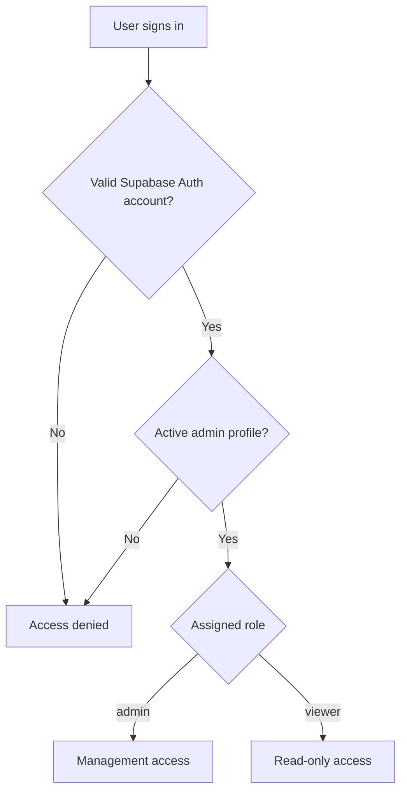

# Cebolletas Copal — Supabase User Administration

This document describes how to administer users who can access the Cebolletas
Copal management application at `/copal/manage/`.

It covers:

- Creating login accounts in Supabase Authentication.
- Granting access through `public.admin_profiles`.
- Assigning `admin` or `viewer` permissions.
- Changing a user's display name or role.
- Temporarily disabling and reactivating access.
- Resetting passwords and changing login email addresses.
- Permanently removing access.
- Verifying accounts, permissions, and Row Level Security (RLS).
- Troubleshooting common access problems.

> This guide is for project owners and trusted administrators with access to
> the Supabase Dashboard. Never place passwords, service-role keys, access
> tokens, or real user credentials in this file, source control, screenshots,
> issues, or pull requests.

## 1. Security model

Access to `/copal/manage/` has two independent layers:

1. **Authentication:** Supabase Auth verifies the user's email and password.
2. **Authorization:** `public.admin_profiles` determines whether that
   authenticated user may use the management application and what role they
   have.

Creating a record under **Authentication → Users** is not sufficient to grant
management access. The Auth user's UUID must also exist in
`public.admin_profiles`, and the profile must be active.



The public application tables are protected by RLS policies that call
`is_active_admin()`. A user who is merely authenticated should not receive
management access.

## 2. Relevant database model

The authorization record is stored in:

```text
public.admin_profiles
```

Verified columns:

| Column | Purpose |
| --- | --- |
| `user_id` | Primary key and foreign key to `auth.users.id`. |
| `display_name` | Human-readable name shown for the administrator. |
| `role` | Value from the `public.admin_role` enum. |
| `active` | Enables or disables management authorization. |
| `created_at` | Profile creation timestamp. |
| `updated_at` | Last profile update timestamp. |

Important constraints:

- `user_id` must reference an existing `auth.users` record.
- Each Auth user can have only one admin profile.
- Deleting the Auth user deletes the related admin profile automatically.
- `display_name` is required and has a database length constraint.
- `active` and the timestamp fields have defaults.

Valid role values:

| Role | Intended access |
| --- | --- |
| `admin` | Full management permissions. |
| `viewer` | Read-only management access. |

Use the least-privileged role that matches the person's actual responsibilities.

## 3. Prerequisites

Before administering users:

- Confirm that you are working in the correct Supabase project.
- Confirm the person's email address through a trusted channel.
- Decide whether the person needs `admin` or `viewer`.
- Decide on a recognizable `display_name`.
- Do not ask users to send passwords through chat, email, tickets, or source
  control.
- Keep at least one tested owner account active while changing access for
  others.

## 4. Create a new management user

Creating a management user is a two-step operation. Complete both steps before
testing access.

### Step 1: Create the Supabase Auth account

1. Open the Supabase Dashboard for the Cebolletas project.
2. Go to **Authentication → Users**.
3. Select **Add user → Create new user**.
4. Enter the user's verified email address.
5. Assign a strong temporary password.
6. Enable **Auto Confirm User** only when you have verified the email and will
   deliver the temporary credentials privately.
7. Create the account.
8. Copy the generated user UUID if desired. The SQL in the next step can also
   resolve the UUID from the email address.

The person still cannot use `/copal/manage/` at this point because they do not
yet have an active `admin_profiles` record.

### Step 2: Grant the management role

Run the following in **SQL Editor**, replacing the example values:

```sql
insert into public.admin_profiles (
  user_id,
  display_name,
  role,
  active
)
select
  id,
  'Pancho',
  'admin'::public.admin_role,
  true
from auth.users
where lower(email) = lower('pancho@example.com')
on conflict (user_id) do update
set
  display_name = excluded.display_name,
  role = excluded.role,
  active = excluded.active,
  updated_at = now()
returning
  user_id,
  display_name,
  role,
  active,
  created_at,
  updated_at;
```

The `on conflict` clause makes the operation safe to repeat for the same user:
it updates the existing authorization record instead of creating a duplicate.

If the query returns no row, the email was not found in `auth.users`. Check the
email under **Authentication → Users** and try again. Do not manually invent a
UUID.

### Create two users in one statement

Create both Auth accounts first. Then use:

```sql
with requested_users(email, display_name, role) as (
  values
    (
      lower('pancho@example.com'),
      'Pancho',
      'admin'::public.admin_role
    ),
    (
      lower('maria@example.com'),
      'María',
      'admin'::public.admin_role
    )
)
insert into public.admin_profiles (
  user_id,
  display_name,
  role,
  active
)
select
  u.id,
  requested.display_name,
  requested.role,
  true
from requested_users requested
join auth.users u
  on lower(u.email) = requested.email
on conflict (user_id) do update
set
  display_name = excluded.display_name,
  role = excluded.role,
  active = excluded.active,
  updated_at = now()
returning user_id, display_name, role, active;
```

Verify that two rows are returned. If only one row is returned, one email did
not match an Auth account.

## 5. Verify a newly created user

### Verify the database record

```sql
select
  u.id as user_id,
  u.email,
  u.email_confirmed_at,
  u.last_sign_in_at,
  p.display_name,
  p.role,
  p.active,
  p.created_at,
  p.updated_at
from auth.users u
left join public.admin_profiles p
  on p.user_id = u.id
where lower(u.email) = lower('pancho@example.com');
```

Expected:

- One row.
- `email_confirmed_at` is populated.
- `display_name` is correct.
- `role` is `admin` or `viewer`, as intended.
- `active` is `true`.

### Verify the application

1. Open `/copal/manage/` in a private browser window.
2. Sign in with the new account.
3. Confirm the expected sections are visible.
4. For a `viewer`, confirm read access and verify that restricted write actions
   are unavailable or rejected.
5. For an `admin`, perform only a safe, reversible test appropriate to the
   application.
6. Sign out and close the private window.

Test one account at a time. A normal browser session may reuse another
administrator's Supabase session and produce a misleading result.

## 6. Change a display name

The visible name belongs to `public.admin_profiles.display_name`; it is not the
Auth email.

Prefer targeting the user by email rather than by the old display name because
display names may not be unique:

```sql
update public.admin_profiles p
set
  display_name = 'Pancho',
  updated_at = now()
from auth.users u
where u.id = p.user_id
  and lower(u.email) = lower('pancho@example.com')
returning
  p.user_id,
  p.display_name,
  p.role,
  p.active,
  p.updated_at;
```

This changes only the displayed name. It does not change the login email,
password, role, or permissions.

Refresh `/copal/manage/`. If the old name remains cached, sign out and back in.

## 7. Change a user's role

### Promote a viewer to admin

```sql
update public.admin_profiles p
set
  role = 'admin'::public.admin_role,
  updated_at = now()
from auth.users u
where u.id = p.user_id
  and lower(u.email) = lower('user@example.com')
returning p.display_name, p.role, p.active, p.updated_at;
```

### Demote an admin to viewer

```sql
update public.admin_profiles p
set
  role = 'viewer'::public.admin_role,
  updated_at = now()
from auth.users u
where u.id = p.user_id
  and lower(u.email) = lower('user@example.com')
returning p.display_name, p.role, p.active, p.updated_at;
```

The user may need to sign out and sign back in before all interface state
reflects the new role.

Before demoting an owner-level administrator, confirm that another tested
`admin` account remains active.

## 8. Temporarily disable access

For temporary suspension or offboarding, set `active = false`. This preserves
the account and its administrative profile for auditing or later
reactivation.

```sql
update public.admin_profiles p
set
  active = false,
  updated_at = now()
from auth.users u
where u.id = p.user_id
  and lower(u.email) = lower('user@example.com')
returning p.display_name, p.role, p.active, p.updated_at;
```

The Auth account may still be able to authenticate, but RLS-protected
management access must be denied because the profile is inactive.

For urgent revocation, also revoke or terminate the user's active Auth sessions
using the supported controls in the Supabase Dashboard. Deactivation protects
database authorization; session revocation ends already-issued sessions.

## 9. Reactivate access

Review the role before reactivating:

```sql
update public.admin_profiles p
set
  active = true,
  updated_at = now()
from auth.users u
where u.id = p.user_id
  and lower(u.email) = lower('user@example.com')
returning p.display_name, p.role, p.active, p.updated_at;
```

Ask the user to sign in again and verify access in a private browser window.

## 10. Remove management authorization

To remove `/manage` authorization while retaining the person's Auth account:

```sql
delete from public.admin_profiles p
using auth.users u
where u.id = p.user_id
  and lower(u.email) = lower('user@example.com')
returning p.user_id, p.display_name, p.role;
```

This is more destructive than setting `active = false`. Prefer deactivation
when access may need to be restored or when you want to retain the profile
record.

## 11. Permanently delete a user

Delete a Supabase Auth user only when permanent removal is intended.

1. First set `active = false`.
2. Confirm that the target email and UUID are correct.
3. Confirm that the person no longer requires access.
4. Revoke active sessions.
5. In **Authentication → Users**, select the exact account and delete it.

Because `admin_profiles.user_id` uses a cascading foreign key, deleting the Auth
user also deletes the related `admin_profiles` record.

Do not delete users with ad hoc SQL against `auth.users`. Use the Supabase
Dashboard or an approved server-side administrative workflow.

## 12. Password administration

### Forgotten password

Use Supabase's password-recovery flow rather than assigning or exchanging a
password through SQL.

If the application exposes **Forgot password**, the user should request a reset
there. Otherwise, use the supported password recovery or administrative reset
control in Supabase.

### Temporary password

If an administrator creates an account with a temporary password:

- Deliver it through a private channel.
- Do not reuse it across users.
- Require the user to replace it immediately.
- Never store it in README files, `.env` files, tickets, commits, or SQL
  history.

### Important distinction

Changing `display_name`, `role`, or `active` in `admin_profiles` does not change
the password. Passwords belong to Supabase Auth.

## 13. Change a login email address

The login email belongs to the Auth account, not `admin_profiles`.

Use the supported Supabase Auth user-management interface to change it. After
the change:

1. Verify the new email.
2. Confirm that the Auth user's UUID did not change.
3. Confirm the same `admin_profiles.user_id` remains linked.
4. Test sign-in with the new email in a private window.

Do not create a second Auth account merely to rename the email unless account
migration is intentional. Creating a new Auth account creates a different UUID
and requires a new `admin_profiles` relationship.

## 14. List all management users

Use this query for a current inventory:

```sql
select
  u.id as user_id,
  u.email,
  p.display_name,
  p.role,
  p.active,
  u.email_confirmed_at,
  u.last_sign_in_at,
  p.created_at,
  p.updated_at
from public.admin_profiles p
join auth.users u
  on u.id = p.user_id
order by
  p.active desc,
  p.role,
  lower(p.display_name);
```

This query intentionally does not return password hashes, tokens, or secrets.

### List authenticated users without an admin profile

```sql
select
  u.id,
  u.email,
  u.email_confirmed_at,
  u.created_at
from auth.users u
left join public.admin_profiles p
  on p.user_id = u.id
where p.user_id is null
order by u.created_at desc;
```

These users can authenticate but should not be authorized for `/manage`.

### List inactive management profiles

```sql
select
  u.email,
  p.display_name,
  p.role,
  p.active,
  p.updated_at
from public.admin_profiles p
join auth.users u
  on u.id = p.user_id
where p.active = false
order by p.updated_at desc;
```

## 15. Verify the authorization configuration

### Confirm available roles

```sql
select
  e.enumsortorder,
  e.enumlabel as role
from pg_type t
join pg_enum e
  on e.enumtypid = t.oid
join pg_namespace n
  on n.oid = t.typnamespace
where n.nspname = 'public'
  and t.typname = 'admin_role'
order by e.enumsortorder;
```

Expected:

```text
admin
viewer
```

### Inspect the profile table columns

```sql
select
  ordinal_position,
  column_name,
  data_type,
  udt_schema,
  udt_name,
  is_nullable,
  column_default
from information_schema.columns
where table_schema = 'public'
  and table_name = 'admin_profiles'
order by ordinal_position;
```

### Inspect constraints

```sql
select
  con.conname as constraint_name,
  pg_get_constraintdef(con.oid) as definition
from pg_constraint con
join pg_class rel
  on rel.oid = con.conrelid
join pg_namespace ns
  on ns.oid = rel.relnamespace
where ns.nspname = 'public'
  and rel.relname = 'admin_profiles'
order by con.conname;
```

### Inspect RLS policies

```sql
select
  schemaname,
  tablename,
  policyname,
  roles,
  cmd,
  qual,
  with_check
from pg_policies
where schemaname = 'public'
order by tablename, policyname;
```

Look for management policies that depend on `is_active_admin()` or another
explicit role check. A policy that grants all operations to every
`authenticated` user deserves immediate review.

### Confirm RLS is enabled

```sql
select
  n.nspname as schema_name,
  c.relname as table_name,
  c.relrowsecurity as rls_enabled,
  c.relforcerowsecurity as rls_forced
from pg_class c
join pg_namespace n
  on n.oid = c.relnamespace
where n.nspname = 'public'
  and c.relkind = 'r'
order by c.relname;
```

## 16. Troubleshooting

### User receives “invalid login credentials”

Check:

- The email is spelled correctly.
- The Auth user exists.
- The email is confirmed.
- The correct Supabase project is being used.
- The password-reset process has been completed.

This error occurs before `admin_profiles` authorization is evaluated.

### User can sign in but cannot open `/manage`

Check the joined account record:

```sql
select
  u.id,
  u.email,
  p.display_name,
  p.role,
  p.active
from auth.users u
left join public.admin_profiles p
  on p.user_id = u.id
where lower(u.email) = lower('user@example.com');
```

Typical causes:

- No `admin_profiles` row exists.
- `active` is `false`.
- The admin profile is linked to a different Auth UUID.
- The user is signed into another account in the browser.
- The application is connected to a different Supabase project.
- The browser has stale session state.

### Insert into `admin_profiles` returns no row

The `select` could not find the email in `auth.users`. Verify the Auth user
exists and use the exact email address.

### Foreign-key violation

The supplied `user_id` does not exist in `auth.users`. Never invent or manually
edit UUIDs; resolve the user by email or copy the UUID from the Dashboard.

### Display-name constraint error

The name is empty or outside the permitted length. Inspect the constraint and
use a short, recognizable name.

### Role-cast error

Only use values defined in `public.admin_role`. The verified values are
`admin` and `viewer`.

### Name or role does not update in the interface

Refresh the page. If needed, sign out, close the private window, and sign in
again. Database authorization remains the source of truth.

### A deactivated user still has an open page

Database operations protected by RLS should fail after authorization is
removed, but the interface may still display cached data. Revoke the user's
active Auth sessions for urgent offboarding and test that new protected
requests are denied.

## 17. Recommended onboarding checklist

- [ ] Confirm the user's identity and email.
- [ ] Choose `admin` or `viewer` using least privilege.
- [ ] Create the Auth account.
- [ ] Confirm the email when appropriate.
- [ ] Add the matching UUID to `public.admin_profiles`.
- [ ] Set a recognizable display name.
- [ ] Verify `active = true`.
- [ ] Verify the joined Auth/profile record.
- [ ] Test in a private browser window.
- [ ] Deliver temporary credentials privately.
- [ ] Require a password change.
- [ ] Record who approved the access outside source control.

## 18. Recommended offboarding checklist

- [ ] Confirm the exact email and UUID.
- [ ] Set `active = false`.
- [ ] Revoke active sessions.
- [ ] Verify `/manage` access is denied.
- [ ] Decide whether to retain or delete the Auth account.
- [ ] Delete the Auth user only when permanent removal is approved.
- [ ] Verify the authorization record is absent after permanent deletion.
- [ ] Record who approved the removal outside source control.

## 19. Operational rules

- Never use the Supabase `service_role` key in browser code.
- Never share the `service_role` key with an administrator who only needs
  `/manage`.
- Never expose `auth.users` directly through public client queries.
- Never disable RLS to solve an access problem.
- Never grant access solely because a user can authenticate.
- Never target a user by display name when email or UUID is available.
- Prefer `active = false` for reversible suspension.
- Use permanent deletion only after confirming the exact target.
- Review active users and roles periodically.
- Test authorization changes with the affected account, not only with an owner
  account.

## 20. Quick-reference SQL

### Grant access

```sql
insert into public.admin_profiles (user_id, display_name, role, active)
select
  id,
  'Display Name',
  'admin'::public.admin_role,
  true
from auth.users
where lower(email) = lower('user@example.com')
on conflict (user_id) do update
set
  display_name = excluded.display_name,
  role = excluded.role,
  active = true,
  updated_at = now()
returning *;
```

### Rename

```sql
update public.admin_profiles p
set display_name = 'New Name', updated_at = now()
from auth.users u
where u.id = p.user_id
  and lower(u.email) = lower('user@example.com')
returning p.*;
```

### Change role

```sql
update public.admin_profiles p
set role = 'viewer'::public.admin_role, updated_at = now()
from auth.users u
where u.id = p.user_id
  and lower(u.email) = lower('user@example.com')
returning p.*;
```

### Disable

```sql
update public.admin_profiles p
set active = false, updated_at = now()
from auth.users u
where u.id = p.user_id
  and lower(u.email) = lower('user@example.com')
returning p.*;
```

### Reactivate

```sql
update public.admin_profiles p
set active = true, updated_at = now()
from auth.users u
where u.id = p.user_id
  and lower(u.email) = lower('user@example.com')
returning p.*;
```

### Verify

```sql
select
  u.email,
  p.display_name,
  p.role,
  p.active,
  u.last_sign_in_at,
  p.updated_at
from public.admin_profiles p
join auth.users u
  on u.id = p.user_id
where lower(u.email) = lower('user@example.com');
```

---

Document baseline: Cebolletas Copal `v9.2.1`.

